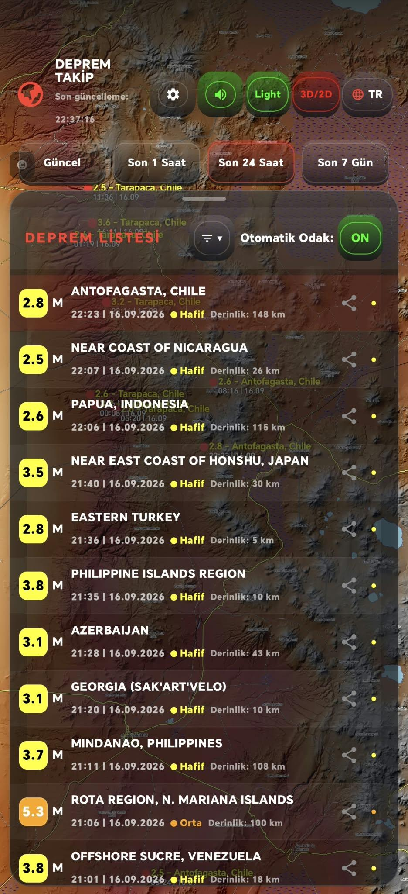
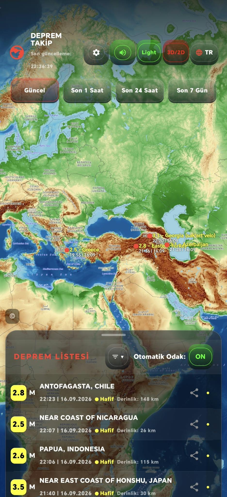
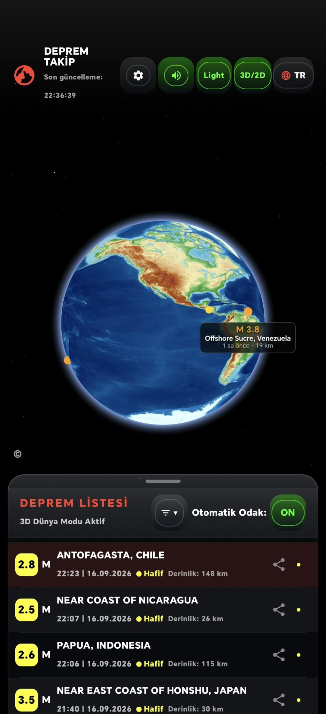
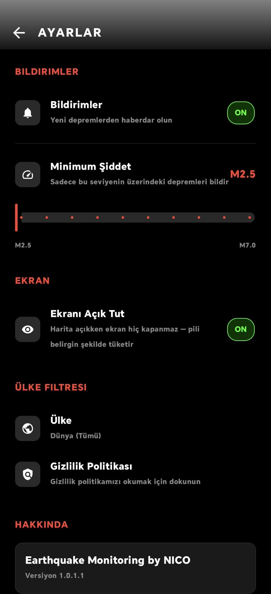
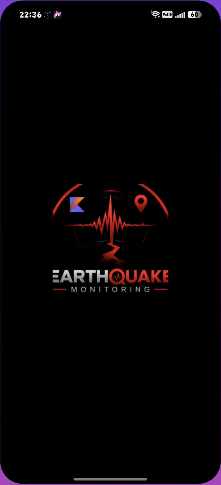
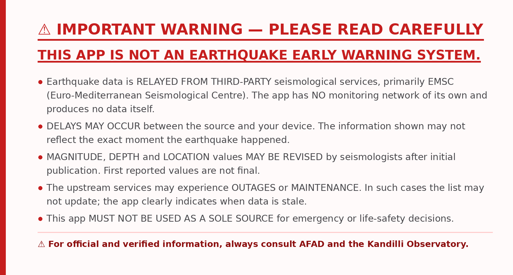

# 🌍 Earthquake Monitoring by NICO

<div align="center">

**Dünya genelindeki depremleri anlık olarak izleyen, modern bir Android uygulaması.**

[](https://github.com/aayurtseven01/earthquake_monitoring)
[](https://developer.android.com)
[](https://kotlinlang.org)
[](https://aayurtseven01.github.io/earthquake_monitoring/)

[📄 Gizlilik Politikası](https://aayurtseven01.github.io/earthquake_monitoring/)

</div>

---

## 🔴 ÖNEMLİ UYARI — LÜTFEN DİKKATLE OKUYUN


### ⚠️ BU UYGULAMA BİR ERKEN UYARI SİSTEMİ DEĞİLDİR.

> **Veriler; EMSC (Avrupa-Akdeniz Sismoloji Merkezi) başta olmak üzere
> ÜÇÜNCÜ TARAF sismoloji kuruluşlarının kamuya açık servislerinden
> AKTARILMAKTADIR. Uygulamanın kendine ait bir ölçüm ağı veya veri
> üretimi YOKTUR.**

**Bilmeniz gerekenler:**

- ⏱️ **GECİKMELER OLABİLİR.** Deprem bilgisinin kaynaktan alınması,
  işlenmesi ve cihazınıza ulaşması zaman alır. Görünen veriler depremin
  gerçekleştiği anı birebir yansıtmayabilir.

- 🔄 **VERİLER REVİZE EDİLEBİLİR.** Bir depremin büyüklük, derinlik ve
  konum bilgileri ilk yayından sonra uzmanlarca düzeltilebilir. İlk
  bildirilen değerler kesin değildir.

- 🔌 **KESİNTİ OLABİLİR.** Veri sağlayıcı servislerde bakım veya erişim
  sorunu yaşanabilir. Böyle durumlarda liste güncellenmeyebilir; uygulama
  eski veri gösterdiğini açıkça belirtir.

- 🚫 **ACİL DURUM KARARLARINDA TEK BAŞINA KULLANILMAMALIDIR.** Bu uygulama
  hayati güvenlik amacıyla tek kaynak olarak alınmamalıdır.

<br>

> ### 🔴 **Resmî ve doğrulanmış bilgi için daima AFAD ve Kandilli Rasathanesi kaynaklarına başvurunuz.**

---

## ✨ Özellikler

### 🗺️ İki farklı görünüm
- **2D Harita** — OpenTopoMap topoğrafik haritası üzerinde deprem işaretçileri
- **3D Etkileşimli Küre** — depremleri dünya üzerinde üç boyutlu görün,
  parmağınızla döndürün, yakınlaştırın

### 🔔 Akıllı bildirimler
- Yeni deprem olduğunda **sesli ve titreşimli** uyarı
- **Minimum şiddet eşiği** (M2.5 – M7.0) — hangi büyüklükte uyarı alacağınızı siz seçersiniz
- Bildirimler ve ses tamamen kapatılabilir
- Eşik **yalnızca uyarıyı** etkiler; deprem listesi tüm depremleri göstermeye devam eder

### 🎛️ Gelişmiş filtreleme
- **Zaman:** Güncel (3 saat) · Son 1 saat · Son 24 saat · Son 7 gün
- **Bölge:** 15 ülke + Dünya geneli
- **Şiddet:** liste içinde alt/üst sınır

### 🌓 Tema
- Harita ve küre dokusu için **koyu / açık** tema
- Sistem temasını izler veya elle değiştirilir

### 📴 Çevrimdışı destek
- Son deprem listesi cihazda saklanır
- Bağlantı yoksa önbellek gösterilir ve **"eski veri"** olarak açıkça işaretlenir

### ⚙️ Diğer
- **Ekranı açık tut** seçeneği (varsayılan açık)
- **Türkçe / İngilizce** tam çeviri
- Otomatik yenileme: ön planda 75 saniyede bir, arka planda 15 dakikada bir

---

## 🔒 Gizlilik

| | |
|---|---|
| Reklam | ❌ Yok |
| Analitik / izleme | ❌ Yok |
| Konum izni | ❌ İstenmez |
| Hesap / üyelik | ❌ Yok |
| Veri satışı | ❌ Yok |

Uygulama yalnızca iki şey için internete bağlanır:
1. **EMSC** (Avrupa-Akdeniz Sismoloji Merkezi) — deprem verisi
2. **OpenTopoMap** — harita görüntüleri

Bu istekler her web isteğinde olduğu gibi IP adresinizi içerir. Tam açıklama
için **[gizlilik politikasını](https://aayurtseven01.github.io/earthquake_monitoring/)**
okuyun.

**İzinler:** yalnızca `INTERNET`, `ACCESS_NETWORK_STATE`, `POST_NOTIFICATIONS`, `VIBRATE`.

---

## 🛠️ Teknolojiler

| Katman | Kullanılan |
|---|---|
| **Dil / UI** | Kotlin, Jetpack Compose, Material 3 |
| **Ağ** | Retrofit, OkHttp, Gson |
| **2D Harita** | osmdroid |
| **3D Küre** | Three.js (WebView, APK içinde gömülü) |
| **Arka plan işleri** | WorkManager |
| **Mimari** | MVVM (ViewModel + StateFlow) |
| **Veri kaynağı** | EMSC FDSN event servisi |

**Minimum Android:** 7.0 (API 24) · **Hedef:** API 37

---

## 📊 Veri kaynağı

Deprem verileri, kamuya açık bir sismoloji servisi olan
**[EMSC](https://www.seismicportal.eu/)** (Avrupa-Akdeniz Sismoloji
Merkezi) FDSN event API'sinden anlık olarak çekilir.

Harita görüntüleri **[OpenTopoMap](https://opentopomap.org/)** sunucularından
gelir:

```
Kartendaten: © OpenStreetMap-Mitwirkende, SRTM
Kartendarstellung: © OpenTopoMap (CC-BY-SA)
```

---

## 🧭 Kullanılan ülkeler

Türkiye · ABD · Japonya · Yunanistan · İtalya · Şili · Endonezya ·
Filipinler · Meksika · Peru · Çin · Hindistan · Yeni Zelanda ·
Avustralya · **Dünya**

Varsayılan: **Türkiye**, **M4.0** eşiği.

---

## 📱 Ekran görüntüleri

<table>
  <tr>
    <td align="center"><b>2D Harita</b><br></td>
    <td align="center"><b>3D Küre</b><br></td>
    <td align="center"><b>Dünya Modu + Liste</b><br></td>
  </tr>
  <tr>
    <td align="center"><b>Ayarlar</b><br></td>
    <td align="center"><b>Açılış</b><br></td>
    <td align="center"></td>
  </tr>
</table>

---

## 👤 Geliştirici

**NICO**

---

## 📄 Lisans ve yasal

- Uygulama kodu © 2026 NICO
- Harita verisi © OpenStreetMap katkıcıları
- Harita görselleştirme © OpenTopoMap — [CC-BY-SA 3.0](https://creativecommons.org/licenses/by-sa/3.0/)
- Deprem verisi © EMSC

Bu uygulama resmî bir erken uyarı sistemi değildir ve acil durumlar için
tek başına güvenilir bir kaynak olarak kullanılmamalıdır.

---
---

# English

<div align="center">

**A modern Android app for tracking earthquakes worldwide, in real time.**

[📄 Privacy Policy](https://aayurtseven01.github.io/earthquake_monitoring/)

</div>

---

## 🔴 IMPORTANT WARNING — PLEASE READ CAREFULLY



### ⚠️ THIS APP IS NOT AN EARTHQUAKE EARLY WARNING SYSTEM.

> **Earthquake data is RELAYED FROM THIRD-PARTY seismological services,
> primarily EMSC (Euro-Mediterranean Seismological Centre). The app has NO
> monitoring network of its own and produces no data itself.**

**What you should know:**

- ⏱️ **DELAYS MAY OCCUR** between the source and your device. The information
  shown may not reflect the exact moment the earthquake happened.

- 🔄 **DATA MAY BE REVISED.** Magnitude, depth and location values can be
  corrected by seismologists after initial publication. First reported
  values are not final.

- 🔌 **OUTAGES MAY OCCUR.** Upstream services may experience maintenance or
  access problems. The list may not update; the app clearly indicates when
  data is stale.

- 🚫 **NOT A SOLE SOURCE FOR EMERGENCY DECISIONS.** This app must not be
  relied upon on its own for life-safety purposes.

<br>

> ### 🔴 **For official and verified information, always consult AFAD and the Kandilli Observatory.**

---

## ✨ Features

- 🗺️ **Two views** — 2D topographic map (OpenTopoMap) and an interactive **3D globe**
- 🔔 **Smart notifications** — sound + vibration, with a **magnitude threshold (M2.5–M7.0)**
  that controls *alerts only*; the list always shows every earthquake
- 🎛️ **Filtering** — time (Live 3h / 1h / 24h / 7 days), 15 regions + worldwide, magnitude range
- 🌓 **Theme** — dark / light map tiles and globe texture
- 📴 **Offline support** — cached list, clearly marked as stale when it is
- ⚙️ **Keep screen on** (default on) · full **Turkish / English** translation
- 🔄 **Auto refresh** — every 75 s in foreground, every 15 min in background

## 🔒 Privacy

| | |
|---|---|
| Ads | ❌ None |
| Analytics / tracking | ❌ None |
| Location permission | ❌ Never requested |
| Account / sign-in | ❌ None |
| Data selling | ❌ None |

Permissions used: `INTERNET`, `ACCESS_NETWORK_STATE`, `POST_NOTIFICATIONS`, `VIBRATE` — nothing else.

## 🛠️ Tech stack

Kotlin · Jetpack Compose · Material 3 · Retrofit + OkHttp + Gson · osmdroid ·
Three.js (bundled, WebView) · WorkManager · MVVM with StateFlow.

**Minimum:** Android 7.0 (API 24) · **Target:** API 37

## 📊 Data sources

- Earthquake data: **[EMSC](https://www.seismicportal.eu/)** FDSN event service
- Map imagery: **[OpenTopoMap](https://opentopomap.org/)** —
  *Kartendaten: © OpenStreetMap-Mitwirkende, SRTM · Kartendarstellung: © OpenTopoMap (CC-BY-SA)*

---

<div align="center">

*Last updated: 16 September 2026 · Version 1.0.1.1*

</div>
